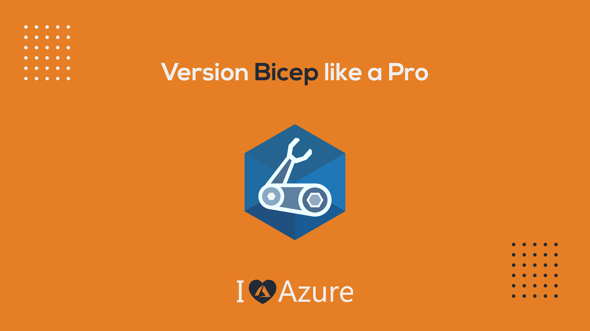
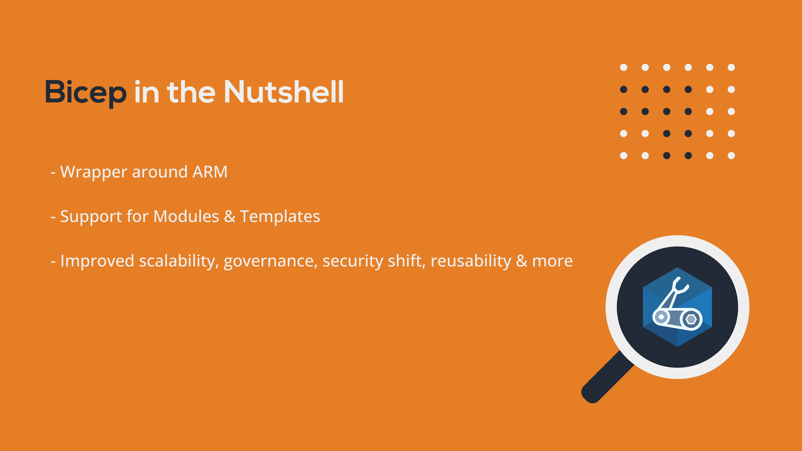
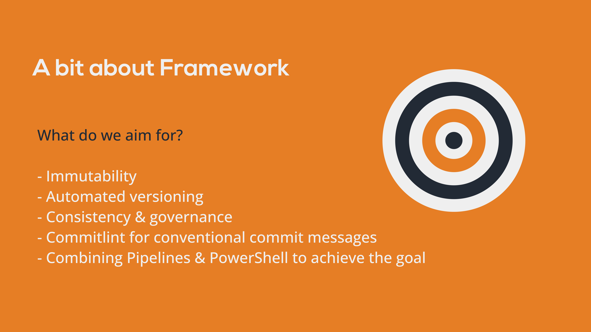
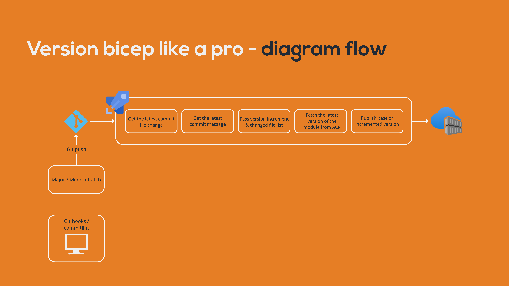

# Bicep Versioning Framework
*The Versioning Framework for the Bicep modules*

  

## Disclaimer  
*The idea and content in the repository are produced by the community.*  
*The content of this repository is used for educational purposes ONLY, and it does not contain any confidential or pirated information.*  
*The programmatic content in this repository might not work in your environment immediately due to some dependencies.*

## About Bicep
  

## What do we aim for?
  

## How does it work?
  

## Installation
The idea is to install commitlint along with the Bicep versioning framework inside your repository.  
First, we will install the Bicep Versioning Framework within the repository
```powershell
& ./Install-BicepVersionFramework.ps1 -GitPath yourRepositoryPath
```
Next, install the [commitlint](https://github.com/conventional-changelog/commitlint)  
Example for macOS
```bash
npm install --save-dev @commitlint/{config-conventional,cli}"
echo "module.exports = {extends: ['@commitlint/config-conventional']}" > commitlint.config.js
npm install husky --save-dev
npx husky install
npx husky add .husky/commit-msg  'npx --no -- commitlint --edit ${1}'
```

