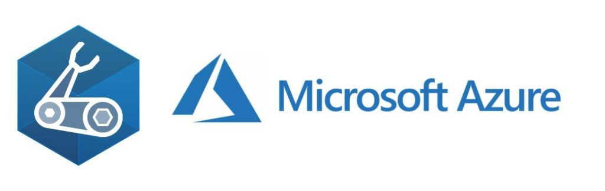

# Bicep Versioning
*The Framework used to version the Bicep modules*

  

## Disclaimer  
*The idea and content in the repository are produced by the community.*  
*The content of this repository is used for educational purposes ONLY, and it does not contain any confidential or pirated information.*  
*The programmatic content in this repository might not work in your environment immediately due to some dependencies.*

## What do we aim for?
*Automated Semantic versioning*  
*Immutability, consistency & governance*  

